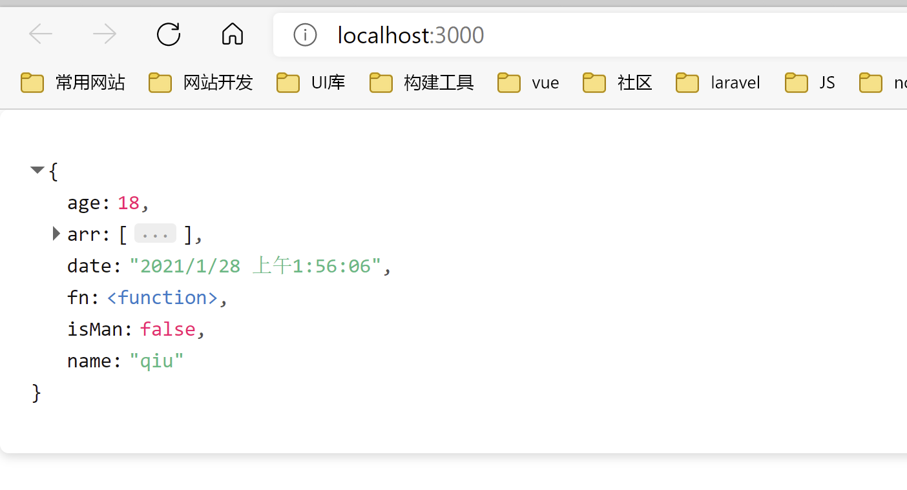
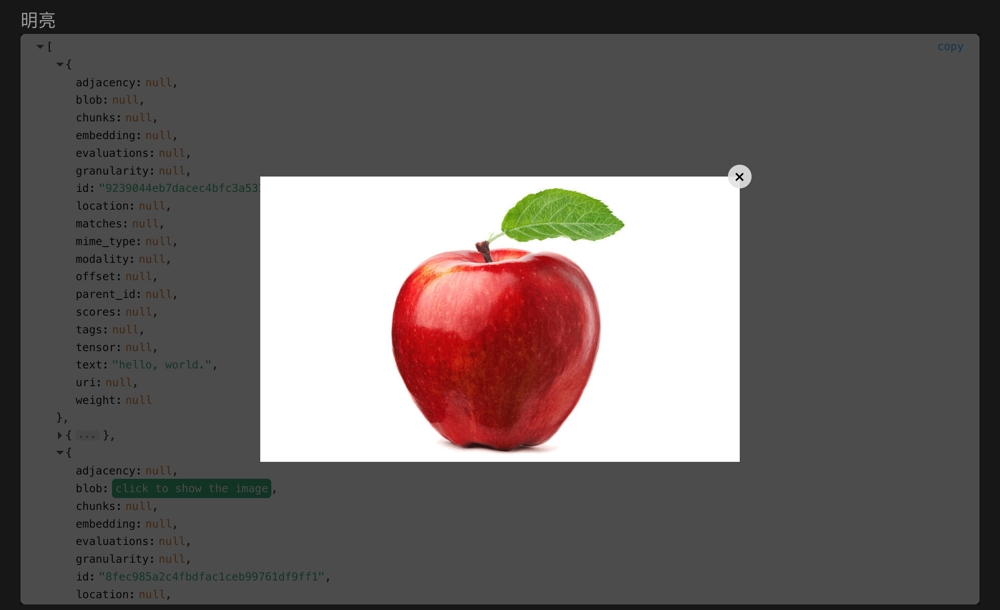

# vue3-json-source-viewer

[中文版](readme_cn.md)

Version 1: Simple and easy-to-use json content display component suitable for `vue3` and `vite`.  
<mark style="background-color: orange">author 1：</mark> [github](https://github.com/chenfengjw163/vue-json-viewer)

Version2: When developing with `vue3`+`vite`, I found that I needed to use the display json data component, and found that `vue-json-viewer` can only be compatible with `vue2`, so it took an hour to rewrite the adaptation of `vue3`.  

<mark style="background-color: orange">author 2</mark> [github](https://github.com/qiuquanwu/vue3-json-viewer)  

Current version: Because the previous versions only support basic data presenting, I fork and extend to make it being able to show image through automatically detecting some specific keys such as 'uri' and 'blob' as well as 'mime_type'. The image will show on a popup window. All changes or extension of this version is mainly for my project requirements.  

<mark style="background-color: orange">Current version: </mark> [github](https://github.com/SmartCodeDavid/vue3-json-viewer)

## Install

Requires `clipboard`

```
$ npm install clipboard --save
```

Then install `vue3-json-source-viewer`

```
$ npm install vue3-json-source-viewer --save
```

## Vue project example  
Enter example directory under vue-project

Install dependencies
``` bash
npm install
```

Start project
``` bash
npm run dev
```

## RecentUpdate
- Support image show(according to key 'mime_type' to judge the data type, show image through obtaining resource from key 'uri' or 'blob' )
- Delete fold/unfold view features that exist on prior versions.

## Usage

main.js

```js
import { createApp } from "vue";
import App from "./App.vue";
import JsonViewer from "vue3-json-source-viewer";
// if you used v1.0.5 or latster ,you should add import "vue3-json-viewer/dist/index.css"
import "vue3-json-viewer/dist/index.css";
const app = createApp(App);
app.use(JsonViewer);
app.mount("#app");
```

App.vue (version 1)

``` html
<template>
<div class="box">
  <h2>light</h2>
 <JsonViewer :value="jsonData" copyable boxed sort theme="jv-light"/>
  <h2>dark</h2>
   <JsonViewer :value="jsonData" copyable boxed sort theme="jv-dark"/>
</div>
 
</template>

<script setup>
import {JsonViewer} from "vue3-json-source-viewer"

import "vue3-json-source-viewer/dist/index.css";
import { reactive, ref } from "vue";
let obj = {
  name: "qiu",//string
  age: 18,//array
  isMan:false,//boolean
  date:new Date(),
  fn:()=>{},
  arr:[1,2,5]
};
const jsonData = reactive(obj);
</script>

<style>
.box{
    margin-top: 1rem;
}
</style>

```

 

App.vue (current version)
``` js
<template>
  <div class="box">
    <h2>light</h2>
    <JsonViewer
      :value="jsonData"
      copyable
      boxed
      sort
      theme="light"
      :allowImageShow="true"
    />
    <h2>dark</h2>
    <JsonViewer :value="jsonData" copyable boxed sort theme="dark" />
  </div>
</template>

<script setup>
// import component
import { JsonViewer } from "vue3-json-source-viewer";

// mock data from document array
import docArrayJson from "./mock/data.json";

import { reactive, ref } from "vue";

const jsonData = reactive(docArrayJson);
</script>

<style>
.box {
  height: 100%;
}
</style>

```

  

click to show image

