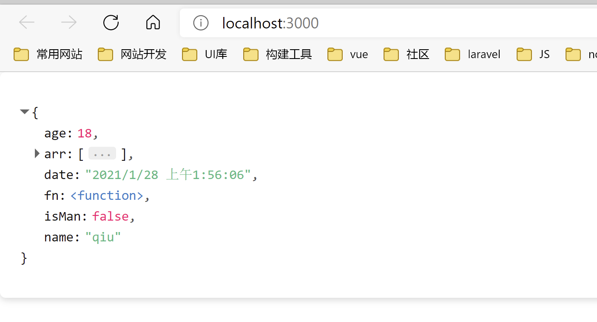
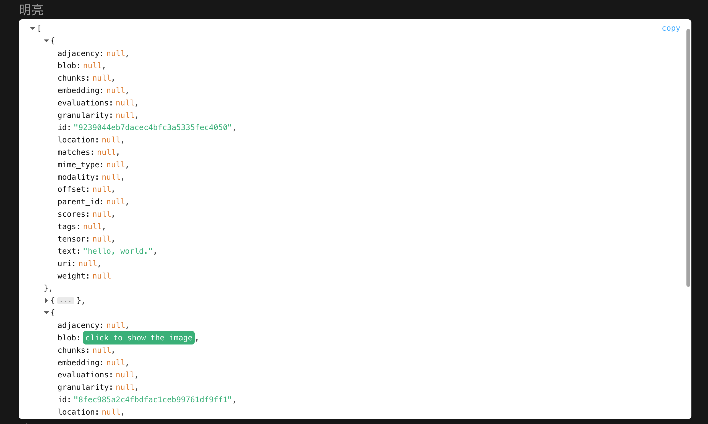
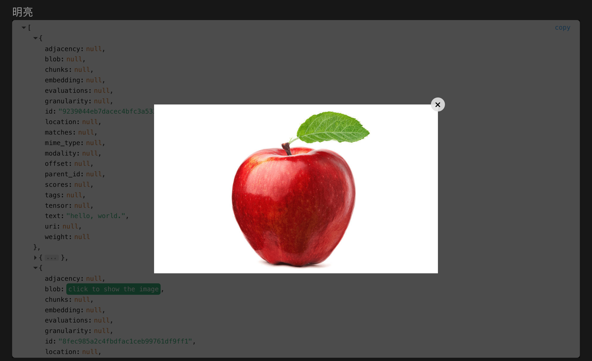

# vue3-json-viewer

版本1：简单易用的json内容展示组件,适配vue3和vite。  
<mark style="background-color: orange">原作者1：</mark> [github](https://github.com/chenfengjw163/vue-json-viewer)

版本2：在使用vue3+vite开发时，发现需要用到显示json数据组件，发现vue-json-viewer只能兼容vue2，于是花了一个小时，重写的vue3的适配。  
<mark style="background-color: orange">原作者2：</mark> [github](https://github.com/qiuquanwu/vue3-json-viewer)  

当前版本： 由于前面两个版本仅支持json数据的基本展示，因项目需要，需对含有图片字段(uri/blob)的数据进行预览，可根据json数据中的mime_type字段来进行判断当前数据是否图片类型，并通过blob/uri字段获取图片的相关信息并弹窗展示  
<mark style="background-color: orange">当前作者：</mark> [github](https://github.com/SmartCodeDavid/vue3-json-viewer)

## 安装

需要依赖clipboard，先安装clipboard

```
$ npm install clipboard --save
```

再安装vue3-json-source-viewer

```
$ npm install vue3-json-source-viewer --save
```

## 引用JSON viewer的Vue使用案例  

进入vue-project下的example目录  

安装依赖
``` bash
npm install
```

启动项目  
``` bash
npm run dev
```

## 近期更新
- 支持图片预览(根据mime_type字段判断是否为图片类型, 通过uri/blob来弹窗展示图片)
- 取消之前版本的向下收起扩展显示功能
  
## 使用

main.js

```js
import { createApp } from 'vue'
import App from './App.vue'
import JsonViewer from "vue3-json-source-viewer"
// if you used v1.0.5 or latster ,you should add import "vue3-json-viewer/dist/index.css"
import "vue3-json-source-viewer/dist/index.css"
const app = createApp(App)
//全局引入
app.use(JsonViewer)
app.mount('#app')
```

App.vue (版本一)

``` html
<template>
<div class="box">
  <h2>明亮</h2>
  <!-- allowImageShow 来控制是否允许展示图片 -->
 <JsonViewer :value="jsonData" copyable boxed sort theme="light" :allowImageShow="true" />
  <h2>暗黑</h2>
  <JsonViewer :value="jsonData" copyable boxed sort theme="light" :allowImageShow="true" />
</div>
 
</template>

<script setup>
//组件引入
import {JsonViewer} from "vue3-json-source-viewer"

import "vue3-json-source-viewer/dist/index.css";
import { reactive, ref } from "vue";
let obj = {
  name: "qiu",//字符串
  age: 18,//数组
  isMan:false,//布尔值
  date:new Date(),
  fn:()=>{},
  arr:[1,2,5]
};
const jsonData = reactive(obj);
</script>

<style>
.box{
    margin-top: 1rem;
}
</style>
```

  

App.vue (当前版本)
``` js
<template>
  <div class="box">
    <h2>明亮</h2>
    <JsonViewer
      :value="jsonData"
      copyable
      boxed
      sort
      theme="light"
      :allowImageShow="true"
    />
    <h2>暗黑</h2>
    <JsonViewer :value="jsonData" copyable boxed sort theme="dark" />
  </div>
</template>

<script setup>
// import component
import { JsonViewer } from "../../../src";

// mock data from document array
import docArrayJson from "./mock/data.json";

import { reactive, ref } from "vue";

const jsonData = reactive(docArrayJson);
</script>

<style>
.box {
  height: 100%;
}
</style>

```

  

点击展示图片

